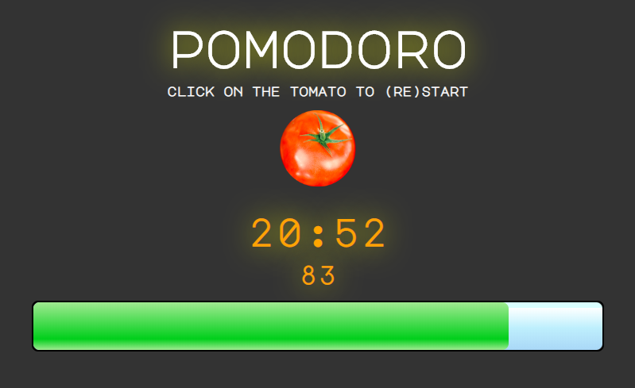

Pomodoro Timer
==============

Pomodoro Timer. Single Page Application, can be run from index.html or using Node from localhost:7666



Click on the tomato to start (or restart) the timer.

To build in Docker, **cd** into the project directory and run

```
docker build --no-cache -t node_pomodoro .
docker run -d -p 7666:7666 node_pomodoro
```
then point the browser to

```
localhost:7666/
```

**Current Issues**

- style is a bit disappointing in Firefox, but works fine in Chrome, Opera and Safari.
- pause has not yet been implemented.
- the number above the progress bar is a percentage; the font chosen doesn't have the % character.
